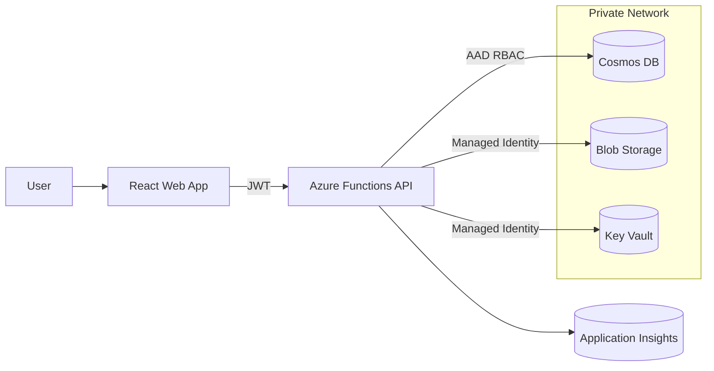

# Azure Secure Multi-Tenant SaaS

Production-grade reference implementation of a secure, multi-tenant SaaS architecture on Azure.

---

## 🛡 Security Posture


This repository demonstrates a secure-by-design SaaS architecture with enforced tenant boundaries, identity-based access control, and private cloud networking by default.

This project demonstrates enterprise cloud patterns including strict tenant isolation, zero-secrets design using Managed Identity, RBAC enforcement, private networking, Infrastructure-as-Code, observability, and Docker-based local development.

The application domain is intentionally minimal ("Tenant Notes") so architectural clarity and security design remain the primary focus.

---

## 🚀 What This Repository Demonstrates

- Hard multi-tenant isolation (data + access boundaries)
- Cosmos DB partitioning by `/tenantId`
- Zero-secrets architecture (Managed Identity only)
- RBAC-based Azure resource access
- Private Endpoints + Private DNS Zones
- VNet-integrated application deployment
- Infrastructure-as-Code using Bicep
- Docker local development mode
- OpenTelemetry tracing + structured logging
- Audit logging for all data mutations

This is a blueprint for building secure SaaS systems — not a feature-heavy product.

---

## 🏗 Architecture Overview



### Key Design Principles

1. Tenant ID is required on every entity
2. Cosmos partition key = `/tenantId`
3. Data access layer enforces tenant boundaries
4. No connection strings stored in configuration
5. All Azure services accessed via Managed Identity

---

## 🔐 Security Model

### Multi-Tenancy

- Every request extracts `tenantId` from JWT
- All database queries are scoped to tenant
- Cross-tenant access is explicitly rejected
- Partition strategy enforces tenant boundary

### Zero-Secrets Design

- Managed Identity for Cosmos, Storage, Key Vault
- No access keys in code or configuration
- Azure RBAC used for data-plane authorization

### Network Isolation

- Private Endpoints for Cosmos, Storage, Key Vault
- VNet integration for application runtime
- Private DNS zones provisioned via IaC

See `/docs/security` for detailed explanations.

---

## 🧩 Repository Structure

```
/apps
  /web              # React + TypeScript frontend
  /api              # Azure Functions API
/packages
  /shared           # Shared types, tenant context, auth helpers
/docs
  /architecture
  /security
  /operations
/infra
  /bicep            # Azure Infrastructure-as-Code
  deploy.ps1
/docker
  docker-compose.yml
```

---

## 💻 Run Locally (Docker)

Requirements:
- Docker
- Node 18+

```bash
docker compose up
```

This launches:
- Web frontend
- API backend
- Local data mode (Cosmos emulator or in-memory fallback)

---

## ☁ Deploy to Azure

Requirements:
- Azure CLI
- Bicep installed
- Proper RBAC permissions

```powershell
cd infra
./deploy.ps1
```

The deployment provisions:

- Resource Group
- Azure Functions or App Service
- Cosmos DB (AAD RBAC enabled)
- Storage Account
- Key Vault
- Managed Identity
- Role Assignments
- Private Endpoints
- Private DNS Zones

---

## 📊 Observability

- OpenTelemetry tracing
- Correlation ID propagation
- Structured JSON logging
- Application Insights integration
- Health endpoint

See `/docs/operations/observability.md` for details.

---

## 📐 Design Tradeoffs

- Simplicity over feature richness
- Strong tenant boundary enforcement over query flexibility
- Managed Identity over connection string convenience
- Clear layering over framework magic

This repository favors architectural clarity and security posture over development speed shortcuts.

---

## 📄 Architecture Decision Records (ADRs)

See `/docs/architecture` for documented design decisions.

---

## 🎯 Intended Audience

- Principal / Staff Engineers
- Platform Engineers
- Engineering Managers
- Cloud Architects
- Security-conscious SaaS builders

---

## 📌 Status

Reference implementation — evolving in staged commits to demonstrate architectural progression.

---

If this project is useful, feel free to fork and adapt for your own secure SaaS foundation.

