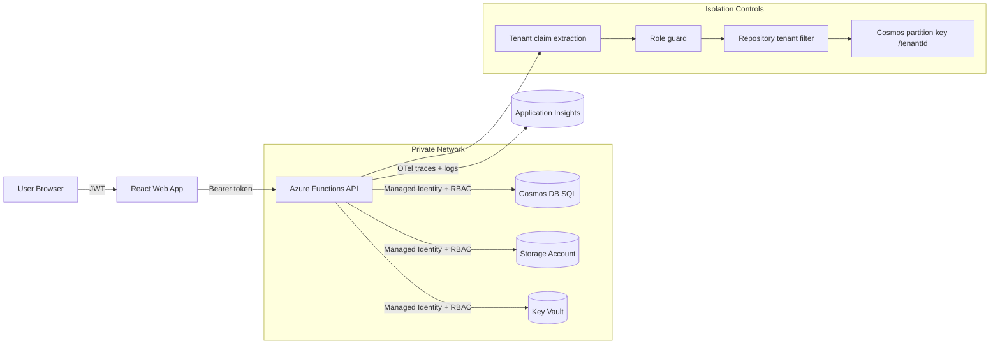

# Azure Secure Multi-Tenant SaaS (Tenant Notes)

Production-oriented reference architecture for a secure, multi-tenant SaaS on Azure with hard tenant isolation, Managed Identity-only data access, RBAC, private networking, infrastructure-as-code, and observability baseline.

## Stack

- Frontend: React + TypeScript + Vite (`apps/web`)
- Backend: Azure Functions-compatible Node + TypeScript API (`apps/api`)
  - Local dev runtime uses an Express host wrapper (`apps/api/src/local/server.ts`)
- Database: Azure Cosmos DB SQL API
- IaC: Bicep (`infra/bicep`)
- Observability: OpenTelemetry + Application Insights
- Local mode: Docker Compose (`docker-compose.yml`)

## Architecture



## Tenant Isolation Guarantees

- Every note includes `tenantId`.
- Cosmos partition key is `/tenantId`.
- All reads and writes are tenant-scoped in repository methods.
- JWT tenant claim is required per request.
- Cross-tenant access resolves as not found/denied.
- Unit tests validate cross-tenant rejection.

## API Endpoints

- `GET /api/notes`
- `POST /api/notes`
- `PUT /api/notes/{id}`
- `DELETE /api/notes/{id}`
- `GET /api/health`

Per request, the API:

1. Extracts `userId` + `tenantId` + `roles` from JWT.
2. Validates role permissions.
3. Enforces tenant scoping in data access.
4. Emits structured audit logs with `correlationId`.

JWT note:

- The API currently parses JWT payload claims but does not perform JWT signature validation directly.
- Signature validation is expected to be enforced by an upstream identity/auth layer in production.

## Zero-Secrets Model

- Cosmos uses endpoint + `ManagedIdentityCredential` (no connection string).
- Function storage uses identity-based settings (`AzureWebJobsStorage__*`).
- Key Vault and Storage access are RBAC-based.
- No application-level Cosmos/Storage/Key Vault connection strings are required.

## Local Development

### Prerequisites

- Node.js 20+
- npm 10+
- Docker Desktop (for compose mode)

### Run API + Web directly

```bash
npm install
npm run dev:api
npm run dev:web
```

Direct run defaults:

- API starts on `http://localhost:7071` and exposes routes under `/api`.
- Web starts on `http://localhost:5173`.
- API defaults to `REPOSITORY_MODE=memory` unless you override environment variables.

### Run with Docker Compose

```bash
docker compose up --build
```

Default compose mode runs API with in-memory repository.

To start Cosmos emulator service as an optional dependency:

```bash
docker compose --profile cosmos up --build
```

Important:

- The compose API service is configured with `REPOSITORY_MODE=memory` by default.
- Enabling the `cosmos` profile starts the emulator container, but does not automatically switch API repository mode to Cosmos.
- To use Cosmos mode locally, provide `REPOSITORY_MODE=cosmos` and related Cosmos env vars to the API service.

## Configuration

API environment variables:

- `REPOSITORY_MODE` = `memory` or `cosmos`
- `COSMOS_ENDPOINT` (required when `REPOSITORY_MODE=cosmos`)
- `COSMOS_DATABASE_ID` (default: `TenantNotes`)
- `COSMOS_CONTAINER_ID` (default: `Notes`)
- `APPLICATIONINSIGHTS_CONNECTION_STRING` (optional for exporter enablement)

## Infrastructure Deployment

### Deploy

```powershell
./deploy.ps1 -SubscriptionId <subscription-id> -ResourceGroupName <rg-name> -Location eastus
```

Optional parameters:

- `-ParameterFile` (default `infra/bicep/parameters.dev.json`)

### Dry run (what-if)

```powershell
./deploy.ps1 -SubscriptionId <subscription-id> -ResourceGroupName <rg-name> -DryRun
```

If the resource group does not exist, create it first or run a full deploy once.

### Templates

- `infra/bicep/main.bicep`
- `infra/bicep/parameters.dev.json`

Provisioned resources include:

- Function App + Premium plan
- Cosmos DB SQL account/db/container (`/tenantId` partition)
- Storage Account (shared key disabled)
- Key Vault (RBAC mode)
- User-assigned Managed Identity
- Role assignments for MI access
- VNet + subnets
- Private endpoints (Cosmos, Storage Blob, Key Vault)
- Private DNS zones and VNet links

## Documentation

- Architecture: `docs/architecture/overview.md`
- ADR: `docs/architecture/ADR-0001-architecture-overview.md`
- Cosmos partitioning: `docs/architecture/cosmos-partition-strategy.md`
- Tenant isolation: `docs/security/tenant-isolation.md`
- Identity and zero-secrets: `docs/security/identity-zero-secrets.md`
- Networking: `docs/security/networking-private-endpoints.md`
- Observability: `docs/operations/observability.md`

## Known Limitations

- JWT signature validation is not implemented in the API process itself; token validation is assumed upstream.
- Test coverage is currently minimal and focused on tenant-boundary/auth helpers in `apps/api/test/tenantBoundary.test.ts`.
- No automated integration tests currently validate Cosmos DB behavior, Azure RBAC bindings, or Bicep deployments.
- Docker Cosmos emulator profile is optional and not wired by default to API Cosmos mode configuration.
